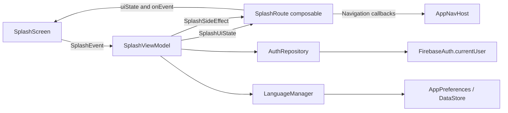

# BikeCare Architecture

## Implementation baseline

BikeCare currently has one Android module, `app`, using feature-first MVVM with
explicit UI state, events, and side effects. Splash is the implemented reference
screen and belongs to the auth feature. This document reflects source inspection;
it does not establish that the app builds or starts successfully.

All paths below are relative to `app/src/main/java/studio/appvero/bikecare`.

```text
BikeCareApplication.kt             # @HiltAndroidApp; registered in manifest
MainActivity.kt                    # Compose host
BikeCareApp.kt                     # Language observation and NavController
features/auth/
  ui/screen/
    SplashContracts.kt             # UiState, Event, SideEffect
    SplashRoute.kt                 # ViewModel and effect wiring
    SplashScreen.kt                # Stateless UI and previews
  ui/viewmodel/SplashViewModel.kt   # Startup orchestration
  data/repository/AuthRepository.kt
core/
  common/Constants.kt
  datastore/                       # AppPreferences and DataStore implementation
  localization/                    # LanguageManager and localized resources
di/                                # Firebase and DataStore modules
navigation/                        # Typed destinations and app graph
ui/theme/                          # Colors, typography, spacing, shapes
```

There are no separate domain, use-case, or feature navigation layers in the
current implementation. Add packages when they have a concrete responsibility;
keep any future domain package limited to models.

## Boundaries

| Component | Responsibility |
| --- | --- |
| Screen | Render immutable state and emit user events |
| Route composable | Resolve ViewModel, collect state/effects, invoke callbacks |
| ViewModel | Handle events, coordinate dependencies, publish state/effects |
| Repository | Own feature data access |
| Core services | Provide shared preferences and localization |
| AppNavHost | Register destinations and execute navigation/back-stack changes |
| Hilt modules | Provide SDK instances and bind shared abstractions |



## Splash behavior

1. The graph starts at the serializable `navigation.SplashRoute` destination.
2. The route composable resolves `SplashViewModel` through Hilt. It observes
   `uiState` with `collectAsStateWithLifecycle()` and collects `sideEffect` inside
   `LaunchedEffect(Unit)`.
3. The ViewModel starts with `SplashUiState.Loading`. Its initializer launches
   language loading and dispatches `CheckAuthentication`. These jobs run
   independently; authentication does not await language initialization.
4. `AuthRepository.isUserLoggedIn()` synchronously checks whether
   `FirebaseAuth.currentUser` is non-null. It does not validate a session with
   the server or use the DataStore `USER_ID` key.
5. On a successful check, the ViewModel waits three seconds, then emits
   `NavigateToHome` or `NavigateToLogin`. State remains `Loading` until navigation.
6. If the repository check throws, state becomes `Error(message)` with the
   throwable message or `Unable to check authentication.`. The screen's Retry
   button dispatches `Retry`, which starts another authentication check.
7. `AppNavHost` executes the navigation callback and removes splash using
   `popUpTo<SplashRoute> { inclusive = true }`.

Splash has no `Success` or `Empty` state because success leaves the screen.
Language initialization errors are outside the authentication error handling,
and Retry does not repeat language initialization.

## Shared services and dependency injection

`FirebaseModule` provides a singleton `FirebaseAuth`. `AuthRepository` uses
constructor injection and has no interface or separate data source yet.
`DataStoreProviderModule` provides the preferences DataStore and `DataStoreModule`
binds `AppPreferencesImpl` to `AppPreferences`.

`LanguageManager` starts with English and reads the stored language during
initialization. `AppPreferencesImpl` defaults missing or unknown language tags
to English. `BikeCareApp` observes language and supplies localized resources
through `ProvideLocalization`.

## Implemented scope versus target design

Implemented data access covers an Auth session snapshot and local language
preferences. Firestore, Storage, FCM, Retrofit, bike/service/reminder repositories,
a business-data local database, and a sync queue are not implemented.

Future business-data features must follow local-first writes and uid-scoped
Firebase paths. See [DATA_LAYER_GUIDE.md](DATA_LAYER_GUIDE.md) and
[FIREBASE_GUIDE.md](FIREBASE_GUIDE.md) for the intended contracts.

## Gaps found during source review

These are follow-up implementation items, not changes made by this documentation
update:

- `MainActivity` injects `LanguageManager` and hosts Hilt ViewModels but lacks
  `@AndroidEntryPoint`. The application annotation alone does not wire activity
  field injection; startup needs this corrected and verified.
- Destination types use `@Serializable` and the JSON library is declared, but
  the Kotlin serialization compiler plugin is not declared/applied in the
  inspected build files. Typed route serializer generation needs configuration
  and validation.
- Home and Login are registered with empty destination bodies. Other declared
  routes are not registered. Successful splash navigation currently leads to
  placeholder content.
- `MutableSharedFlow(extraBufferCapacity = 1)` uses the default zero replay.
  The extra buffer does not retain an effect for a future subscriber when no
  collector exists. The three-second delay does not guarantee navigation delivery.
- Repeated authentication events launch independent jobs; there is no guard
  against concurrent checks or duplicate navigation effects.
- Language loading is neither awaited before navigation nor mapped to splash
  error state. Its failure is unhandled in that initialization coroutine.
- `BikeCareApp` nests two identical `ProvideLocalization(language)` calls.
  Splash text is hardcoded English and does not use `localizedString`.
- Only template tests exist; splash behavior has no automated coverage.

See [TESTING_GUIDE.md](TESTING_GUIDE.md) for verification priorities.
